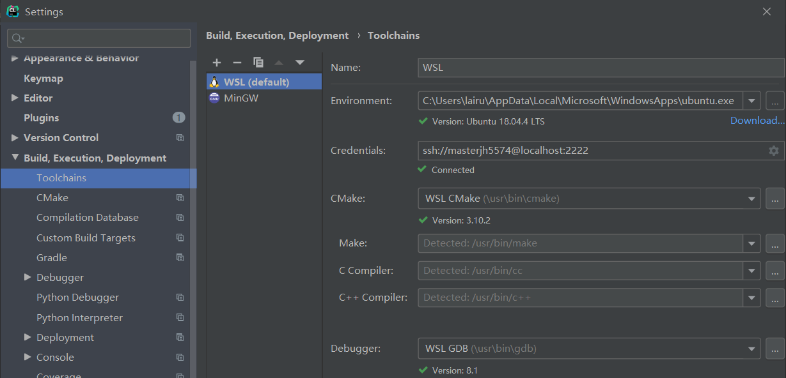
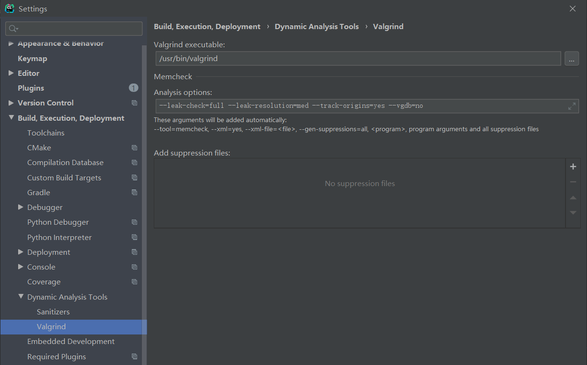
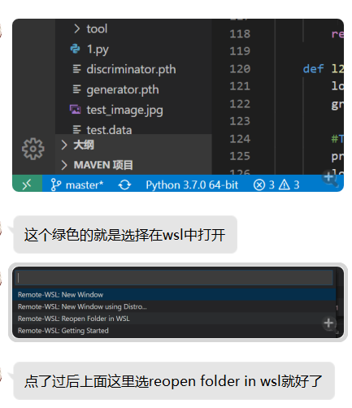

# 如何检测内存泄漏？

内存泄漏了怎么办？教你几招~

## 安装 WSL

**注意：安装好 WSL 与 Valgrind 是本教程检测内存泄漏的前提！**

首先，请在 Windows 10 中安装好 *Windows Subsystem for Linux(WSL)*，可以参考 [https://www.jianshu.com/p/3e627ff45ccb](https://www.jianshu.com/p/3e627ff45ccb)

打开 WSL，使用 `sudo apt install valgrind` 命令安装 valgrind

## 在 CLion 中使用

* 请将你的 CLion 与 WSL 连接好，参见官方文档 [https://www.jetbrains.com/help/clion/how-to-use-wsl-development-environment-in-clion.html](https://www.jetbrains.com/help/clion/how-to-use-wsl-development-environment-in-clion.html) 或博客 [https://blog.csdn.net/u010606602/article/details/80782650](https://blog.csdn.net/u010606602/article/details/80782650)

  

* 在 CLion Settings - Build, Execution, Deployment - Dynamic Analysis Tools - Valgrind 中将 Valgrind executable 设为 `/usr/bin/valgrind`，将 Analysis options 设为 `--leak-check=full --leak-resolution=med --track-origins=yes --vgdb=no`

  

* 退出 Settings，在右上角 Run 的右侧你可以看到 “Run with Valgrind Memcheck”，点击即可进行内存泄漏检测。

  

## 在 Visual Studio Code 中使用

**不保证此教程绝对正确 ~~，因为我从来没有用过 VSCode~~ ，还望大家多请教多摸索。**

* 请将你的 VSCode 与 WSL 连接好，参见官方文档 [https://code.visualstudio.com/docs/remote/wsl](https://code.visualstudio.com/docs/remote/wsl)

* 请将 [tasks.json](https://github.com/MasterJH5574/CS158-DS-Project/blob/master/tutorials/detect-memory-leak/for-vscode/tasks.json) 文件里的 valgrind task 添加到你自己的 tasks.json 文件中。

* 在 VSCode 中 Reopen Folder in WSL。

  

* Build 得到可执行文件后，在任务栏 Terminal - Run Task 中选择 "valgrind" 来运行 Valgrind。

## 在 Visual Studio 里使用

我一点也不清楚怎么用（甚至不知道能不能用）……快去问问用 VS 的大佬，抱他们的大腿吧！

## 直接在 WSL 里使用

**这是最粗暴的方法，只要你装好了 WSL 就可以**。

**此方法等同于在 CLion, Visual Studio, Visual Studio Code 等 IDE/Editor 中打开 Terminal 运行上述命令。**

假设 Build 编译得到的可执行文件为 code，使用 `valgrind --tool=memcheck --leak-check=full --leak-resolution=med --track-origins=yes --vgdb=no ./code` 命令运行 Valgrind。

## 最后……

最好的解决方法也许是一次性写出一份不内存泄漏的代码？

祝大家写出一点也不漏的代码！

